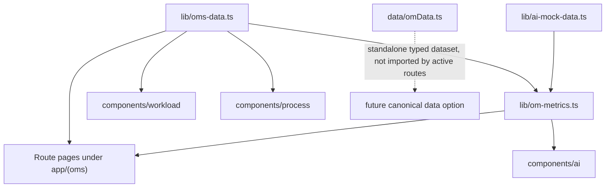
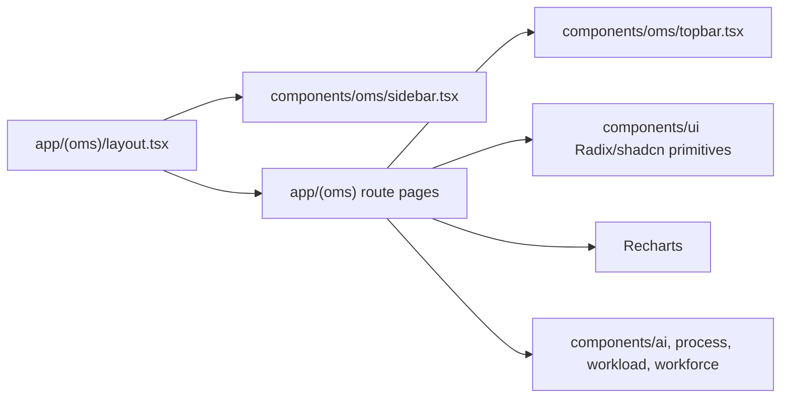
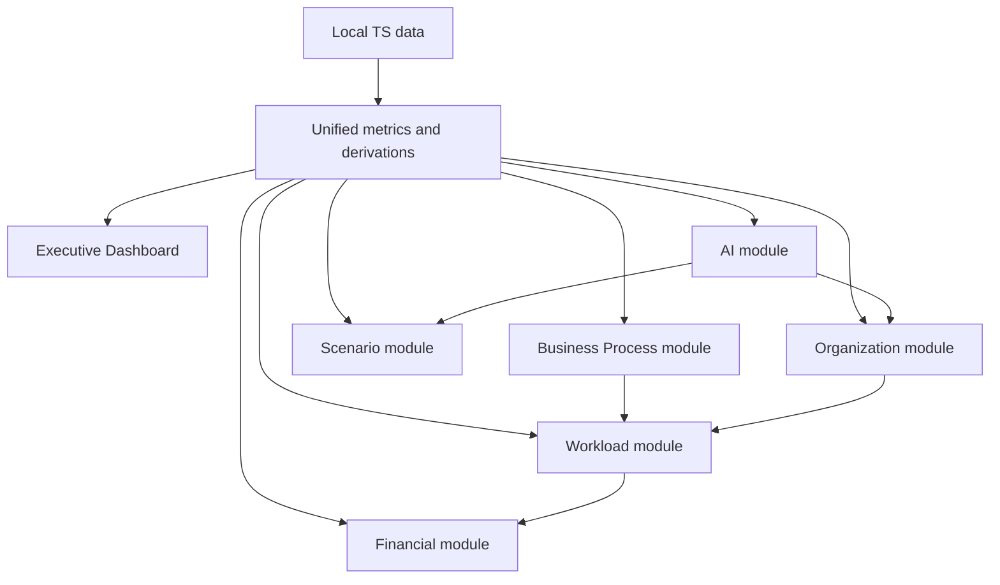
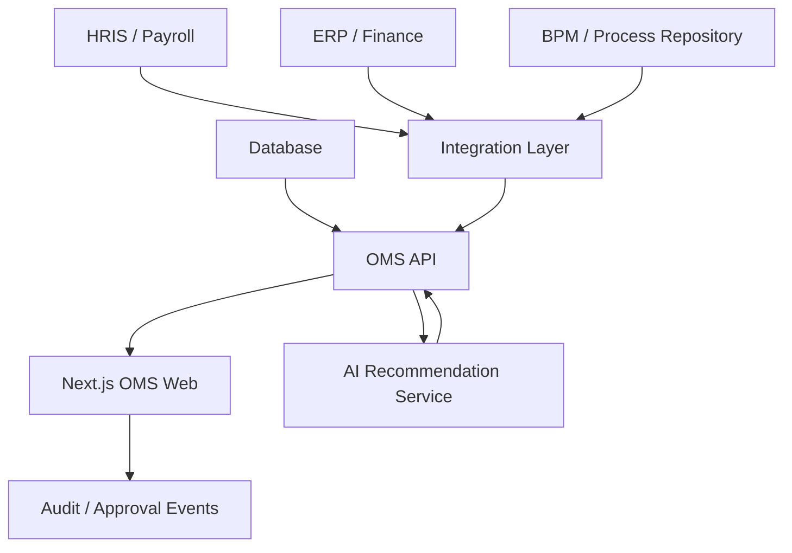

# OMS Architecture

## 1. Ringkasan Arsitektur

OMS adalah aplikasi **Next.js App Router** berbasis React dan TypeScript. Implementasi saat ini bersifat frontend-heavy: halaman membaca data dari file lokal TypeScript, menghitung metrik di client/server render, lalu menampilkan UI interaktif dengan state React lokal.

Belum ditemukan backend API, database, auth, atau service integration. Karena itu arsitektur saat ini paling tepat disebut **interactive prototype / frontend application with deterministic local data**.

## 2. Stack

- Framework: Next.js `16.2.4`.
- UI runtime: React `19`.
- Language: TypeScript.
- Styling: Tailwind CSS `4`, CSS variables, shadcn-style component structure.
- UI primitives: Radix UI.
- Charting: Recharts.
- Icons: lucide-react.
- Analytics: Vercel Analytics only in production.
- Theme helper: next-themes dependency ada, tetapi penggunaan tema tidak menjadi inti arsitektur OMS.

## 3. Struktur Folder

```text
app/
  layout.tsx
  globals.css
  (oms)/
    layout.tsx
    page.tsx
    organization/
    business-process/
    workload-activity/
    financial/
    scenario/
    ai/
components/
  oms/
  ai/
  process/
  workload/
  workforce/
  ui/
lib/
  oms-data.ts
  om-metrics.ts
  ai-mock-data.ts
  oms-activities.ts
  enterprise-dataset.ts
  currency.ts
  utils.ts
data/
  omData.ts
```

## 4. Layout dan Navigasi

Root layout `app/layout.tsx` mendefinisikan metadata:

- Title: `OM+ - Organization Management`.
- Description: executive-level organization management for workforce planning, business processes, workload, and financial oversight.

OMS layout `app/(oms)/layout.tsx` membungkus semua halaman OMS dengan:

- `Sidebar` dari `components/oms/sidebar.tsx`.
- Main content area.

Sidebar membaca `navModules` dari `lib/oms-data.ts`, sehingga menu utama berasal dari data layer, bukan hardcoded di layout.

## 5. Route Map

```text
/                                           Executive OMS Dashboard
/organization/tree                          Organization Tree
/organization/positions                     Position Directory
/organization/positions/create              Create Position
/organization/positions/[id]                Position Detail
/organization/positions/[id]/edit           Edit Position
/organization/employees                     Employee Directory
/organization/employees/[id]                Employee Detail
/business-process/process-chain             Process Chain
/business-process/process-directory         Process Directory
/business-process/process-directory/[id]    Process Detail
/workload-activity/activity-directory       Activity Directory
/workload-activity/activity-directory/[id]  Activity Detail
/workload-activity/utilization-dashboard    Utilization Dashboard
/workload-activity/assignment-management    Assignment Management
/workload-activity/workload-engine          Redirect to assignment-management
/financial/overview                         Cost Overview
/financial/breakdown                        Cost Breakdown
/scenario/directory                         Scenario Directory
/scenario/builder                           Scenario Builder
/scenario/comparison                        Scenario Comparison
/scenario                                   Redirect to scenario/directory
/ai/insights                                AI Insights
/ai/job-position                            AI Job Position
/ai/job-position/[positionId]               AI Position Detail
/ai                                         Redirect to ai/insights
/position/[id]                              Redirect alias to organization/positions/[id]
```

## 6. Data Architecture



### 6.1 `lib/oms-data.ts`

Ini file data utama. Isinya:

- Employees awal.
- Departments.
- Positions.
- Vacancies dan recruitment pipeline.
- KPI list.
- Dashboard activity log.
- Process list, process chains, I/O mapping, dependencies, KPI maps.
- Scenarios.
- Navigation modules.
- Extended employees generated deterministic.
- Workload constants dan workload activity derivation.
- Cost analysis dan alerts.

### 6.2 `lib/om-metrics.ts`

File ini menjadi bridge/normalizer. Isinya:

- Baseline company metrics.
- Department baseline.
- Scenario baseline.
- Validation functions.
- Unified exports untuk departments, positions, scenarios, processes, activities, employees, KPI, workload, cost, alerts, dan AI.
- Organization unit tree untuk PT Pelabuhan Indonesia (Persero).
- Helper rollup company/directorate/department.
- `buildOrganizationTree` untuk menghasilkan tree company -> directorate -> department -> position -> employee.

### 6.3 `lib/ai-mock-data.ts`

File ini menyimpan:

- AI departments.
- AI business process labels.
- 12 AI insights.
- 8 AI generated positions.
- AI scenarios.

Data ini dipakai modul AI untuk insight card, detail drawer, generated position, cost estimate, workload analysis, dan source evidence.

### 6.4 `data/omData.ts`

File ini adalah dataset TypeScript terpisah dengan type `OrganizationUnit`, `Position`, `Employee`, `BusinessProcess`, `Activity`, `Scenario`, `AIInsight`, dan `AIGeneratedPosition`. File ini juga menjalankan `validateRelationships()` untuk memastikan referensi antar-entitas valid.

Namun dari pencarian import saat ini, route aktif tidak memakai `omData`. Ini kandidat kuat untuk canonical dataset masa depan, tetapi belum menjadi source of truth runtime.

## 7. Component Architecture



Komponen penting:

- `Sidebar`: navigasi modul, collapse/expand, active route.
- `TopBar`: header halaman dengan title, subtitle, breadcrumb.
- `AiAssistant`: floating assistant/quick actions, local response mapping.
- `AIModuleLayout`: shell khusus untuk AI pages.
- `AIInsightsPage`: filter, scope, insight card, drawer, cross-module action.
- `AIJobPositionPage`: generator, library table, generated card, drawers, modal submit/simulate/export.
- `ActivityForm`: form kalkulasi workload.
- `ProcessDetailPanel`: panel detail lama/komponen proses, sebagian aksi masih alert demo.

## 8. State Management

State management saat ini memakai `useState`, `useMemo`, dan query params. Tidak ada global store seperti Redux/Zustand.

Konsekuensi:

- Perubahan create/edit/delete pada scenario atau AI position hanya hidup di session React page tersebut.
- Refresh browser akan mengembalikan data ke baseline lokal.
- Tidak ada conflict handling atau multi-user behavior.

## 9. Rendering Model

Banyak halaman memakai `"use client"` karena banyak interaksi lokal, filter, chart, dialog, dan state. Dynamic route detail memakai async params dari Next.js, tetapi tetap membaca data lokal.

Tidak ditemukan:

- `app/api/**`.
- `route.ts`.
- `fetch()` ke backend.
- ORM atau database client.
- Auth middleware.

## 10. Data Flow Utama



## 11. Current Architecture Risks

- `lib/oms-data.ts` terlalu besar dan memegang banyak domain sekaligus.
- Ada beberapa dataset paralel: `oms-data`, `om-metrics`, `omData`, `enterprise-dataset`, `ai-mock-data`.
- Data baseline metric dan record aktual tidak selalu sama jumlahnya.
- Aksi create/edit/delete belum persisted.
- Demo alerts dan placeholder actions masih ada.
- Tidak ada boundary jelas antara product data, sample data, mock AI output, dan calculated runtime data.

## 12. Target Architecture yang Disarankan

Untuk production, arah arsitektur sebaiknya:



Prioritas:

1. Pilih canonical data model.
2. Pecah data layer per domain.
3. Tambah persistence untuk scenario dan position proposal.
4. Tambah auth/role.
5. Jadikan AI recommendation traceable dan auditable.
