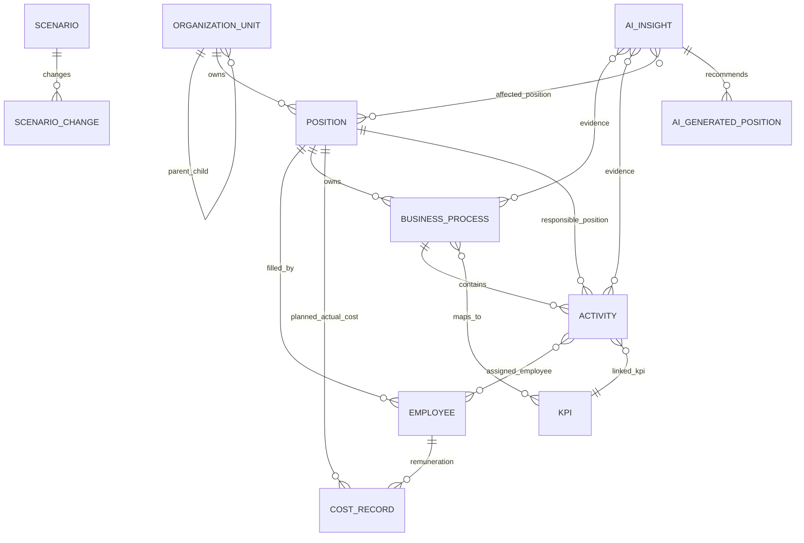

# OMS Domain Model

## 1. Domain Utama

OMS dibangun di atas beberapa domain yang saling terhubung:

- Organization Unit.
- Department / Directorate.
- Position.
- Employee.
- Business Process.
- Activity.
- KPI.
- Workload.
- Cost.
- Scenario.
- AI Insight.
- AI Generated Position.

## 2. Entity Relationship



## 3. Organization Unit

Representasi struktur organisasi:

- Company: `PT Pelabuhan Indonesia (Persero)`.
- Directorate.
- Department.

Sumber:

- `organizationUnits` di `lib/om-metrics.ts`.
- `departments` di `lib/oms-data.ts`.
- `data/omData.ts` memiliki model alternate: directorate, division, department.

Field penting:

- `id`
- `name`
- `type`
- `parentId`

## 4. Department

Department menyimpan kapasitas dan baseline organisasi:

- `hc`
- `headPlan`
- `gap`
- `budget`
- `utilized`
- `head`
- `location`
- `vacancies`
- `spanOfControl`
- `avgTenure`
- `kpi`
- `cost`

Di `om-metrics`, department baseline juga menyimpan:

- employees.
- positions.
- vacancies.
- overstaffedAllocation.
- avgUtilizationPct.
- monthlyCost.

## 5. Position

Position adalah unit desain jabatan. Field utama:

- `id`
- `title`
- `dept`
- `deptId`
- `grade`
- `level`
- `filled`
- `planned`
- `status`
- `salaryMin`
- `salaryMax`
- `competencies`

Position dipakai untuk:

- directory dan detail jabatan.
- fill rate dan headcount gap.
- cost planning.
- assignment ke employee.
- owner business process.
- AI-generated position comparison.

## 6. Employee

Employee adalah incumbent atau pekerja. Field utama:

- `id`
- `name`
- `position`
- `dept`
- `deptId`
- `grade`
- `level`
- `status`
- `salary`
- `cost`
- `utilization`
- `kpiScore`
- `manager`
- `managerId`
- `hireDate`
- `tenure`
- `email`
- `phone`
- `location`
- `riskScore`

Data awal berisi 24 employee eksplisit, lalu `employeesAll` menambah 200 generated employee untuk modul workload.

## 7. Business Process

Process record aktif berada di `processList`.

Field utama:

- `id`
- `name`
- `code`
- `dept`
- `deptId`
- `ownerPosition`
- `ownerId`
- `owner`
- `category`
- `sla`
- `actualTime`
- `status`
- `frequency`
- `bottleneck`
- `slaMet`
- `efficiency`
- `kpiScore`
- `previousProcess`
- `nextProcess`
- `inputSource`
- `outputDeliverable`
- `description`
- `lastUpdated`
- `version`

Kategori proses:

- Strategic.
- Financial.
- Operations.
- Talent.
- Governance.

## 8. Process Chain, I/O, Dependency

Process chain mengelompokkan process menjadi flow:

- Strategic-Operational.
- Talent Lifecycle.
- Product Pipeline.
- Marketing-to-Sales.

Process I/O mapping menjelaskan input/output antar-process:

- fromProcess.
- toProcess.
- input.
- output.
- dataType.
- frequency.

Process dependency menyimpan:

- fromProcess.
- toProcess.
- criticality.
- delay.

## 9. KPI

KPI list dasar menyimpan:

- Workforce Coverage.
- Budget Utilization.
- Avg Time to Hire.
- Process Efficiency.
- Audit Compliance.
- Employee Satisfaction.
- Cost per Hire.
- Retention Rate.

Process KPI map menghubungkan process ke KPI dengan:

- processId.
- kpiId.
- processName.
- kpiName.
- impact.
- weightage.
- target.
- actual.
- trend.

## 10. Activity

Ada dua level activity:

1. `activityList`: activity dasar per process, dihasilkan dari template 5 aktivitas per process.
2. `workloadActivities`: versi lengkap dengan formula workload, staffing status, org link, KPI link, trend, dan cost.

Field penting `workloadActivities`:

- `activityCode`
- `processId`
- `processCode`
- `processName`
- `processCategory`
- `seq`
- `name`
- `frequencyType`
- `frequencyValue`
- `duration`
- `responsiblePosition`
- `assignedEmployees`
- `complexityLevel`
- `reworkRate`
- `qualityReviewFactor`
- `seasonalPeakFactor`
- `productivityFactor`
- `monthlyCapacity`
- `effectiveCapacityPerFte`
- `baseWorkload`
- `adjustedWorkload`
- `requiredHc`
- `assignedHc`
- `hcGap`
- `utilization`
- `staffingStatus`
- `criticality`
- `linkedKpiId`
- `previousActivityId`
- `nextActivityId`
- `trend`

## 11. Cost

Cost muncul di beberapa bentuk:

- Department cost baseline.
- Employee salary/cost.
- Position salary range.
- Cost analysis per department.
- Cost monthly trend.
- Derived employee loaded cost di financial pages.
- Activity monthly cost dari workload activity.
- Scenario cost impact.
- AI generated position cost estimate.

Formula cost analysis utama:

```text
Total Cost = Salary + Benefits + Bonus
```

Financial pages juga menambah allowances, overtime, dan component toggles untuk UI analysis.

## 12. Scenario

Scenario record menyimpan:

- `id`
- `name`
- `description`
- `type`
- `status`
- `createdBy`
- `lastUpdated`
- `hc`
- `hcImpact`
- `cost`
- `costImpact`
- `util`
- `kpi`

Scenario builder membuat perubahan lokal terhadap:

- departments.
- positions.
- hiring speed.
- attrition rate.
- growth percentage.
- salary change.
- benefits percentage.
- bonus percentage.

Output hitungan:

- scenario headcount.
- scenario cost.
- scenario utilization.
- scenario KPI.
- deltas vs baseline.
- scenario status.

## 13. AI Insight

AI insight menyimpan:

- category.
- severity.
- confidenceScore.
- department.
- affectedPositions.
- affectedProcesses.
- affectedActivities.
- summary.
- recommendation.
- reasoning.
- dataEvidence.
- impactProjection.
- financialImpact.
- workloadImpact.
- kpiImpact.
- suggestedActions.
- status.
- createdAt.
- sourceModules.

AI insight bertindak sebagai decision object yang menghubungkan module evidence ke rekomendasi.

## 14. AI Generated Position

Generated position adalah desain jabatan baru hasil rekomendasi AI.

Field utama:

- positionName.
- nomenclature.
- department.
- jobFamily.
- jobLevel.
- employmentType.
- status.
- reportsTo.
- directSubordinates.
- reasonForCreation.
- businessObjective.
- roleSummary.
- coreResponsibilities.
- keyDeliverables.
- linkedBusinessProcesses.
- linkedKPIs.
- linkedActivities.
- workloadAnalysis.
- costEstimate.
- competencyRequirements.
- reportingStructure.
- implementationPlan.
- impactAnalysis.
- risksIfNotCreated.
- sourceInsight.
- scenarioReadiness.

## 15. Source of Truth Saat Ini

Secara runtime, source paling aktif adalah:

1. `lib/oms-data.ts`
2. `lib/om-metrics.ts`
3. `lib/ai-mock-data.ts`

`data/omData.ts` terlihat lebih rapi secara typing dan validasi relasi, tetapi belum dipakai oleh route aktif. Untuk production, perlu diputuskan apakah `omData.ts` menjadi canonical model atau tetap memakai `oms-data.ts` yang dipecah per domain.
