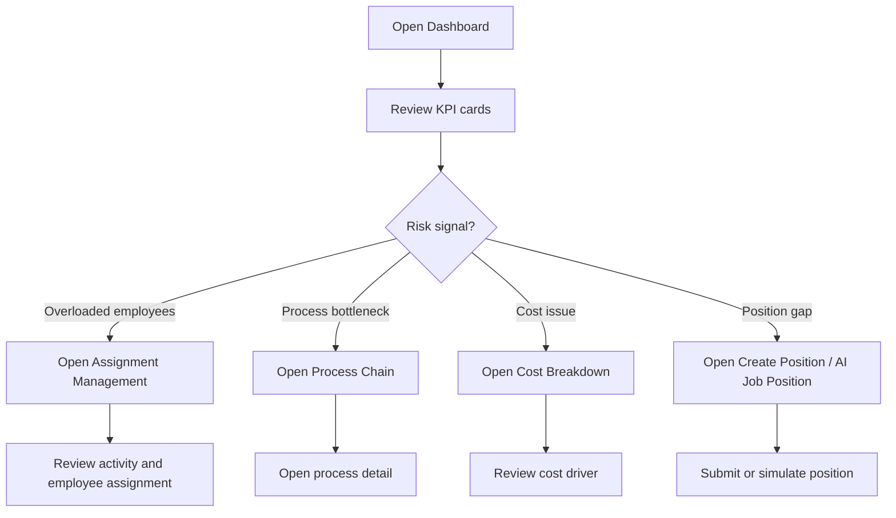
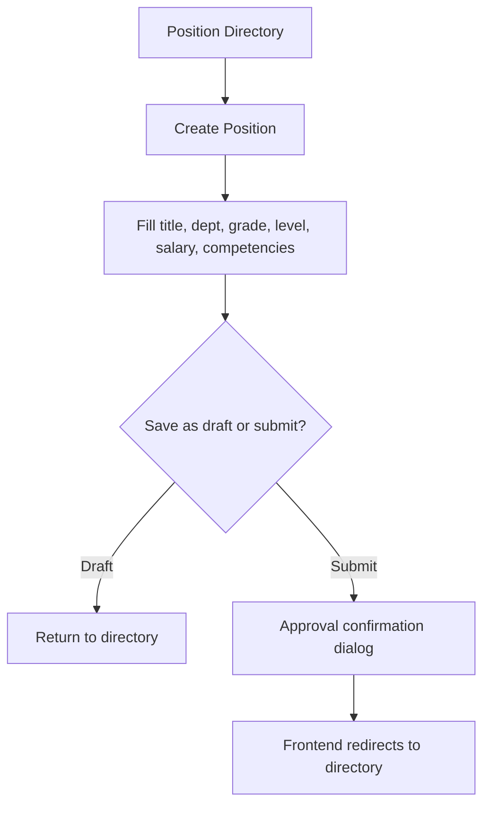
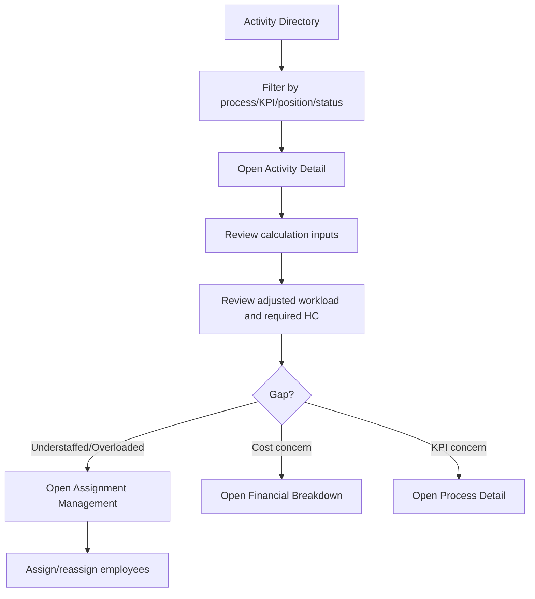
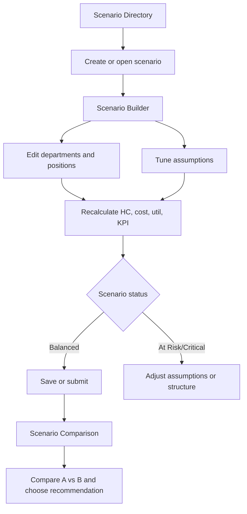
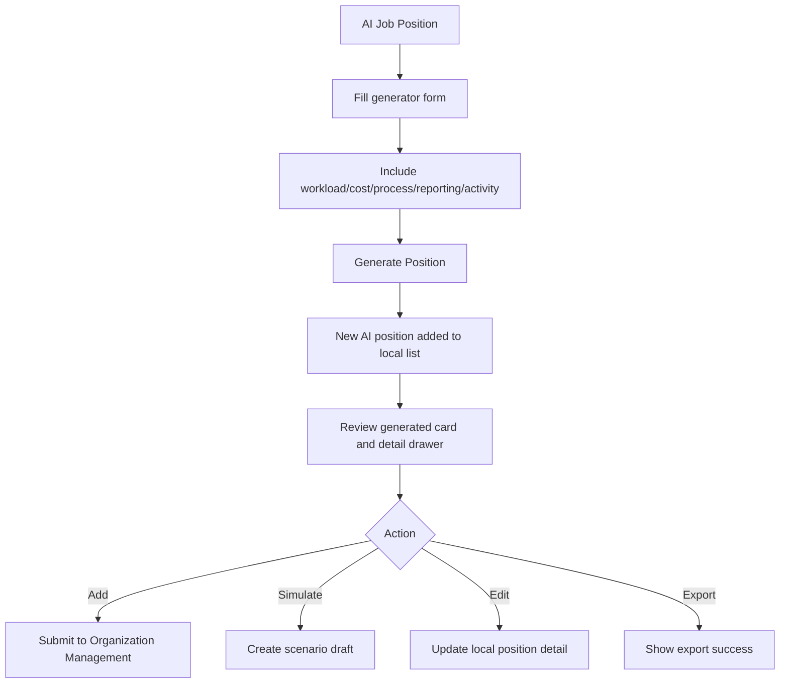
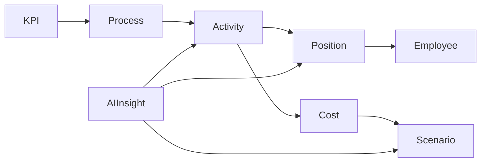

# OMS User Flows

## 1. Executive Triage Flow

Tujuan: executive melihat risiko organisasi dan masuk ke tindakan.

## 2. Organization Review Flow

Tujuan: HC/OD memeriksa struktur organisasi dan membuka detail jabatan/karyawan.

1. User membuka `/organization/tree`.
2. User memilih overlay `cost` atau `utilization`.
3. User mencari directorate, department, position, atau employee.
4. User expand company -> directorate -> department.
5. User membuka position detail atau employee detail.
6. Jika ada gap, user masuk ke position directory atau create position.
7. Jika ada overload, user masuk ke assignment management atau utilization dashboard.

## 3. Position Governance Flow

Tujuan: membuat atau mengubah jabatan.

Catatan implementasi: perubahan belum persisted. Flow ini perlu backend approval untuk production.

## 4. Process Diagnosis Flow

Tujuan: process owner melihat bottleneck dan akar masalah.

1. User membuka `/business-process/process-chain`.
2. Filter department/category/status.
3. Buka process detail dari node chain.
4. Review process profile, SLA, actual time, status, owner.
5. Review linked activities dan assigned employees.
6. Review linked KPI dan process cost.
7. Jika activity menjadi sumber masalah, buka activity detail.
8. Jika owner/position bermasalah, buka position atau employee detail.

## 5. Activity Workload Flow

Tujuan: workforce planner menghitung beban kerja dan kebutuhan HC.

## 6. Financial Analysis Flow

Tujuan: finance melihat biaya dan menemukan optimization opportunity.

1. User membuka `/financial/overview`.
2. User mengatur cost component toggle.
3. User memilih aggregation mode: Org, Role, atau Process.
4. User memeriksa top cost, trend, cost vs utilization, heatmap, overcost engine.
5. User membuka `/financial/breakdown` untuk granular drilldown.
6. User mengganti view: Org, Position, Employee.
7. User membuka employee atau position detail jika perlu tindakan.
8. User membuka scenario planning untuk simulasi dampak biaya.

## 7. Scenario Planning Flow

Tujuan: transformation/strategy membuat simulasi perubahan organisasi.

## 8. AI Insight to Position Flow

Tujuan: AI memberi rekomendasi berbasis evidence, lalu user membuat posisi baru atau scenario.

1. User membuka `/ai/insights`.
2. User filter severity/category/department.
3. User buka insight detail.
4. User review evidence: workload, HC gap, KPI impact, cost impact, affected activity.
5. User klik generate position.
6. OMS membuka `/ai/job-position/[positionId]`.
7. User review generated job design.
8. User memilih:
   - add to organization.
   - simulate in scenario.
   - edit details.
   - export design.
9. Jika submit ke organization, status berubah lokal menjadi `Submitted to Organization Management`.

## 9. AI Position Generation Flow

## 10. Cross-Module Traceability Flow

OMS paling kuat saat dipakai lintas modul:

Prinsip flow: user tidak berhenti di satu dashboard. Setiap risk signal harus bisa dilacak ke owner, activity, position, cost, dan scenario action.
