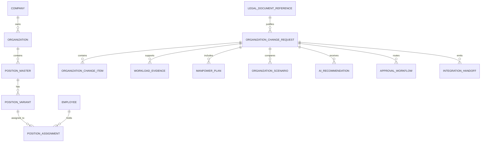

# OMS Portaverse-Aligned Data Model

## 1. Prinsip Model

OMS harus mengikuti Portaverse/PMS data model sebagai vocabulary integrasi. OMS tidak boleh membuat master data paralel untuk company, organization, position, employee, atau assignment jika konsep tersebut sudah ada di Portaverse/PMS.

OMS menyimpan data workflow yang belum dimiliki source system:

- proposal;
- change item;
- workload evidence;
- manpower plan;
- scenario;
- AI recommendation;
- approval;
- integration handoff;
- audit.

## 2. Master Data yang Direferensikan

Referensi dari Portaverse/PMS:

- `Company`
- `Organization`
- `PositionMaster`
- `PositionVariant`
- `Employee`
- `PositionAssignment`

Mapping staging BE/PMS:

| OMS Concept | Portaverse/PMS Entity | Staging BE Alignment |
|---|---|---|
| Company | `Company` | `tb_company_in` |
| Organization | `Organization` | `tb_group_master`, `tb_position_master_organization_sync` |
| Position definition | `PositionMaster` | `tb_position_master_v2` |
| Effective position variant | `PositionVariant` | `tb_position_master_variant` |
| Worker identity | `Employee` | `tb_employee` |
| Incumbent/assignment | `PositionAssignment` | `tb_employee_position_master_sync` |

## 3. Organization Type Extension

PMS prototype organization type masih terbatas. Untuk OMS, organization type perlu mendukung:

- `HOLDING`
- `SUBHOLDING`
- `ANAK_PERUSAHAAN`
- `AFILIASI`
- `TERAFILIASI`
- `KANTOR_PUSAT`
- `REGIONAL`
- `SUB_REGIONAL`
- `CABANG`
- `TERMINAL`
- `PELABUHAN`
- `DIREKTORAT`
- `GROUP`
- `DIVISI`
- `DEPARTEMEN`
- `UNIT_PENDUKUNG`

Label UI dapat memakai Bahasa Indonesia, tetapi enum internal sebaiknya stabil dan backend-friendly.

## 4. OMS-Owned Entities

### 4.1 OrganizationChangeRequest

Header proposal perubahan organisasi.

Field awal:

- `request_id`
- `request_number`
- `title`
- `description`
- `change_category`
- `status`
- `requester_employee_number`
- `company_id`
- `org_id`
- `impact_level`
- `effective_date`
- `legal_reference_id`
- `created_at`
- `updated_at`

### 4.2 OrganizationChangeItem

Detail item perubahan.

Field awal:

- `change_item_id`
- `request_id`
- `object_type`
- `object_id`
- `operation`
- `before_snapshot`
- `after_snapshot`
- `reason`
- `impact_summary`
- `approval_implication`

Object type:

- `COMPANY`
- `ORGANIZATION`
- `POSITION_MASTER`
- `POSITION_VARIANT`
- `POSITION_ASSIGNMENT`

Operation:

- `CREATE`
- `UPDATE`
- `DELETE`
- `MOVE`
- `ACTIVATE`
- `DEACTIVATE`

### 4.3 WorkloadEvidence

Bukti workload yang mendukung proposal.

Field awal:

- `evidence_id`
- `request_id`
- `evidence_type`
- `source_system`
- `source_record_id`
- `period_start`
- `period_end`
- `granularity`
- `org_id`
- `position_master_variant_id`
- `activity_name`
- `volume`
- `sla_target`
- `sla_actual`
- `shift_code`
- `workload_hours`
- `required_fte`
- `actual_fte`
- `confidence_level`

Granularity:

- `MONTHLY`
- `DAILY`
- `SHIFT`

### 4.4 ManpowerPlan

Perhitungan kebutuhan tenaga kerja.

Field awal:

- `manpower_plan_id`
- `request_id`
- `org_id`
- `position_master_id`
- `position_master_variant_id`
- `period`
- `required_fte`
- `actual_fte`
- `fte_gap`
- `criticality`
- `assumptions`
- `evidence_ids`

### 4.5 OrganizationScenario

Scenario baseline/proposed/alternative.

Field awal:

- `scenario_id`
- `request_id`
- `scenario_type`
- `name`
- `description`
- `structure_snapshot`
- `fte_impact`
- `cost_impact`
- `risk_impact`
- `operational_impact`

### 4.6 AIRecommendation

Rekomendasi AI yang dapat diterima/ditolak user.

Field awal:

- `recommendation_id`
- `request_id`
- `recommendation_type`
- `affected_object_type`
- `affected_object_id`
- `reason`
- `evidence_used`
- `confidence_level`
- `risk_level`
- `suggested_action`
- `approval_implication`
- `human_decision`
- `human_decision_note`

### 4.7 ApprovalWorkflow dan ApprovalDecision

Routing dan keputusan approval.

Field awal workflow:

- `workflow_id`
- `request_id`
- `template_code`
- `current_step`
- `status`

Field awal decision:

- `decision_id`
- `workflow_id`
- `step_number`
- `approver_role`
- `approver_employee_number`
- `decision`
- `comment`
- `decided_at`

Decision:

- `APPROVE`
- `REJECT`
- `REQUEST_REVISION`
- `REQUEST_MORE_EVIDENCE`
- `APPROVE_WITH_CONDITION`

### 4.8 IntegrationHandoff

Catatan handoff setelah proposal approved.

Field awal:

- `handoff_id`
- `request_id`
- `target_system`
- `payload_snapshot`
- `handoff_status`
- `created_at`
- `executed_at`
- `error_message`

### 4.9 LegalDocumentReference

Referensi legal untuk Perdir/SK/dokumen organisasi.

Field awal:

- `legal_reference_id`
- `document_type`
- `document_number`
- `document_title`
- `effective_date`
- `source_file`
- `source_page`
- `notes`

## 5. Relationship Model

## 6. Adapter Boundary

Frontend view models boleh stabil dan human-readable. API integration harus memakai adapter untuk:

- numeric/string ID differences;
- enum differences;
- backend naming differences;
- snapshot serialization;
- audit payload;
- source metadata.

Jangan mengikat UI langsung ke raw DTO staging BE karena PMS benchmark menunjukkan prototype FE dan BE staging belum field-compatible.
