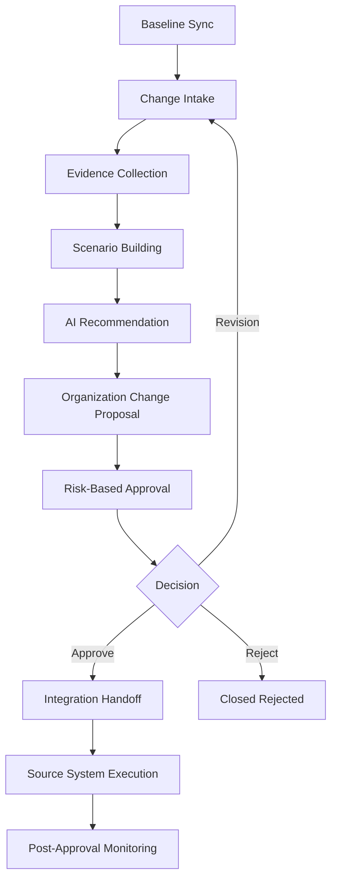
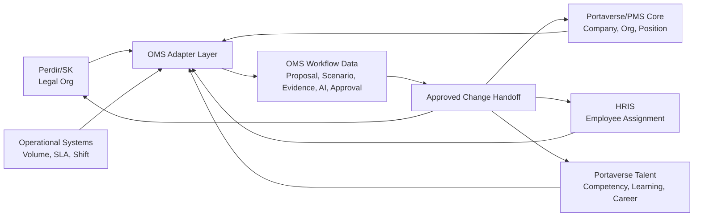

# OMS Workflow dan Integration Architecture

## 1. End-to-End Workflow

## 2. Workflow Detail

### 2.1 Baseline Sync

OMS membaca baseline dari source system:

- legal org dari Perdir/SK atau legal org repository;
- company/organization/position context dari Portaverse/PMS;
- employee-position assignment dari HRIS;
- talent/competency/performance context dari Portaverse;
- workload operational dari operational systems.

Baseline bersifat read-only di OMS.

### 2.2 Change Intake

User membuat proposal perubahan:

- company entity CRUD;
- organization unit CRUD;
- reporting line change;
- position/job CRUD;
- position variant/formasi change;
- assignment context change;
- competency/job family/job grade change.

### 2.3 Evidence Collection

OMS mengumpulkan evidence:

- corporate monthly workload;
- terminal daily/shift activity;
- marine/vessel service activity;
- SLA;
- volume;
- utilization;
- overtime;
- backlog;
- incumbent/assignment;
- competency/performance context.

### 2.4 Scenario Building

User membandingkan:

- baseline;
- proposed;
- alternative.

Setiap scenario menampilkan:

- FTE impact;
- cost impact;
- span of control;
- vacancy;
- competency gap;
- approval risk;
- operational readiness.

### 2.5 AI Recommendation

AI memberikan rekomendasi berbasis evidence.

AI tidak boleh:

- mengubah master data;
- auto-approve proposal;
- membuat struktur baru tanpa confirmation;
- menyembunyikan evidence atau alasan.

### 2.6 Organization Change Proposal

Proposal utama berisi:

- summary perubahan;
- affected object;
- before/after structure;
- business justification;
- workload evidence;
- manpower plan;
- scenario business case;
- legal reference;
- risk/impact assessment;
- approval trail.

### 2.7 Risk-Based Approval

Approval template dipilih berdasarkan:

- change type;
- impact level;
- organization level;
- FTE impact;
- cost impact;
- legal impact;
- operational impact;
- cross-company/subholding/regional impact.

### 2.8 Integration Handoff

Setelah approved, OMS membuat handoff ke source system yang berwenang.

OMS tidak langsung mengubah:

- legal org master;
- HRIS;
- Portaverse Talent;
- operational systems.

## 3. Source System Architecture

## 4. Data Ownership Matrix

| Data | Source of Truth | OMS Role |
|---|---|---|
| Legal organization | Perdir/SK / legal org repository | mirror/reference |
| Company | Portaverse/PMS or enterprise master | mirror/reference |
| Organization | Portaverse/PMS or legal org master | mirror/reference |
| Position master | Portaverse/PMS | mirror/reference |
| Position variant | Portaverse/PMS | mirror/reference |
| Employee | HRIS | mirror/reference |
| Position assignment | HRIS / Portaverse sync | mirror/reference |
| Competency/talent | Portaverse Talent | mirror/reference |
| KPI/performance | Portaverse PMS | mirror/reference |
| Operational workload | Operational systems | evidence source |
| Proposal | OMS | system of record |
| Scenario | OMS | system of record |
| Workload evidence package | OMS | system of record |
| AI recommendation | OMS | system of record |
| Approval trail | OMS | system of record |
| Handoff | OMS | system of record |

## 5. Approval Matrix Awal

| Change Type | Low Impact | Medium Impact | High Impact |
|---|---|---|---|
| Position update | HC OD + Function Owner | HC OD + Function Owner + HC Lead | HC OD + HC Lead + Executive Sponsor |
| New position | HC OD + Workforce Planning | HC OD + Finance + HC Lead | HC OD + Finance + Legal + Executive Sponsor |
| Organization unit update | HC OD + Function Owner | HC OD + Legal + HC Lead | HC OD + Legal + Executive Sponsor |
| New organization unit | HC OD + Legal + HC Lead | HC OD + Finance + Legal + Executive Sponsor | Director/Board-level approval |
| Reporting line change | HC OD + Function Owner | HC OD + HC Lead + Legal if needed | Executive Sponsor + Legal |
| Company entity CRUD | Legal + Corporate Secretary | Legal + Corporate Secretary + Finance | Director/Board-level approval |
| Terminal/marine formation change | Operations Owner + HC Workforce Planning | Operations + HC + Finance | Operations + HC + Finance + Executive Sponsor |

## 6. Integration Events

Event minimal:

- `organization.baseline.synced`
- `organization.change.drafted`
- `organization.change.submitted`
- `organization.change.approved`
- `organization.change.rejected`
- `organization.change.revision_requested`
- `organization.change.handoff_created`
- `organization.change.executed`
- `workload.evidence.attached`
- `ai.recommendation.generated`
- `ai.recommendation.accepted`
- `ai.recommendation.rejected`

## 7. Error and Exception Handling

Minimal production behavior:

- Missing source data harus ditandai sebagai data issue, bukan disembunyikan.
- Conflict antar-source system harus muncul sebagai evidence warning.
- Proposal tidak boleh submitted jika mandatory evidence hilang.
- Handoff failure harus masuk retry queue dan audit log.
- Mutasi staging/testing setup endpoint tidak boleh dipakai oleh product client.
